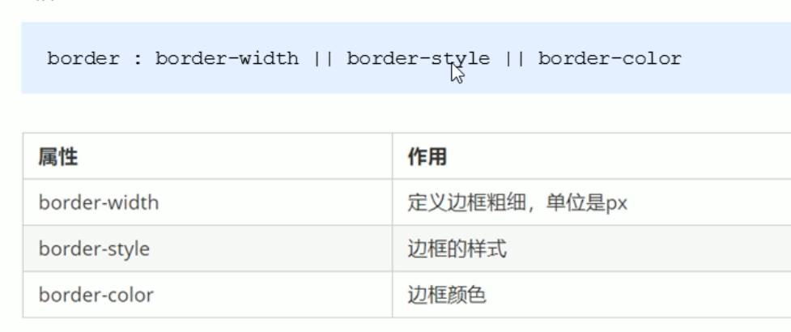
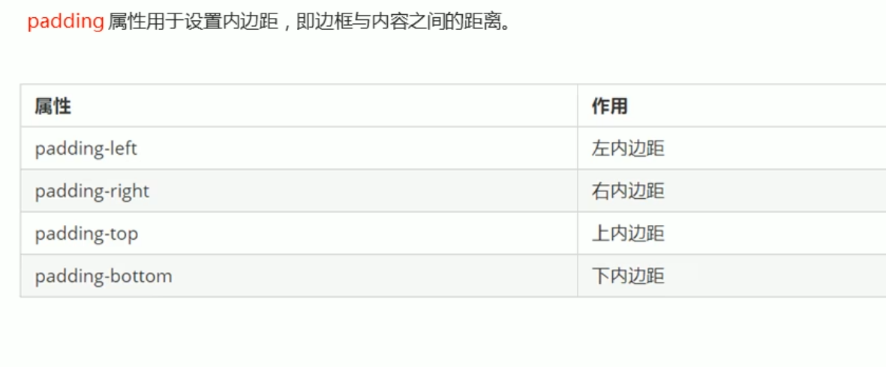
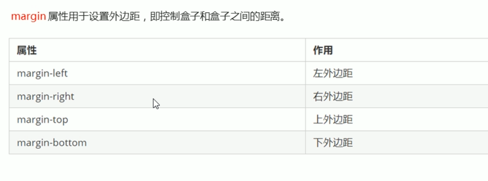
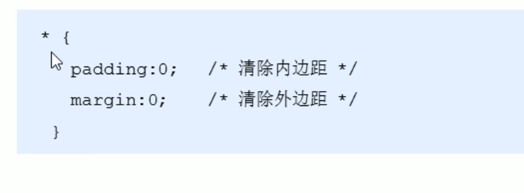

### 盒子模型
所谓盒子模型，就是把HTML里面的布局元素看作一个矩形盒子，也就是一个盛装内容的容器。  
CSS盒子模型本质上就是一个盒子，封装周围的HTML元素，它包括：边框，外边框，内边距，和实际内容等。  

##### 盒子模型边框

##### 盒子模型内边距

内边距会撑开盒子，可以用来做导航栏，保证导航栏里字体间距相等  

##### 盒子外边距

外边距可以让块级盒子水平居中  
想要块级盒子水平居中，必须满足以下两个条件：  
1. 盒子必须指定宽度  
2. 盒子左右外边距都设置auto  

行内元素或者行内块元素水平居中，可以给他们的父亲元素添加 text-align:center  

##### 清楚内外边距
网页元素中很多都带有默认的内外边距，而且不同浏览器默认也不一样。新词我们在布局前，首先要清楚下网页元素的内外边距。  

