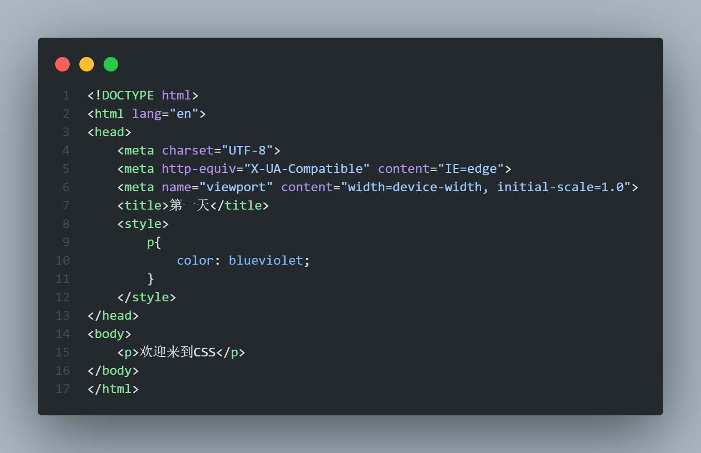
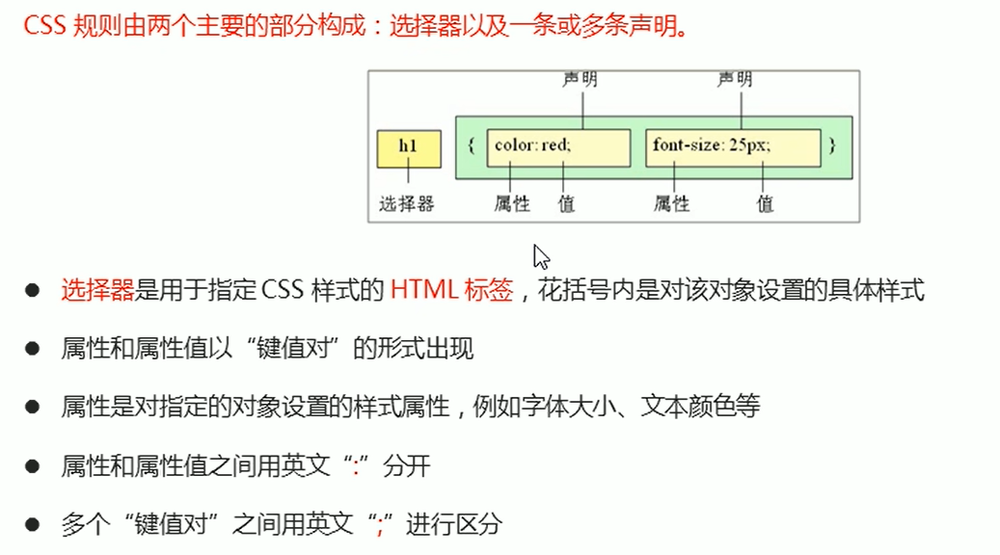
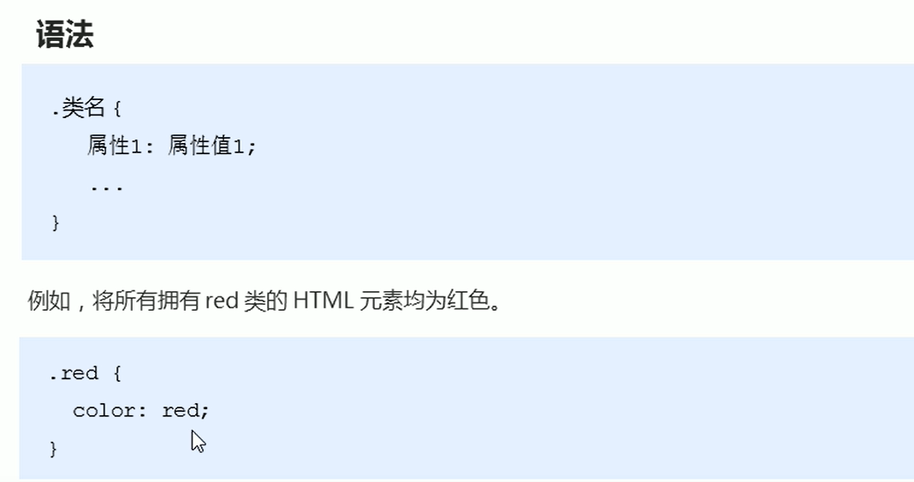
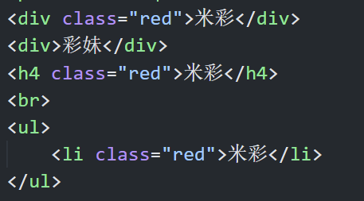
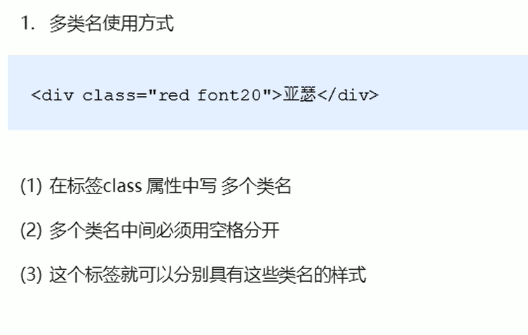
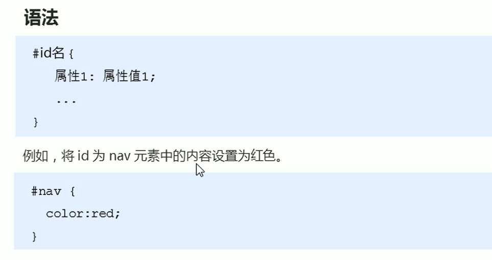
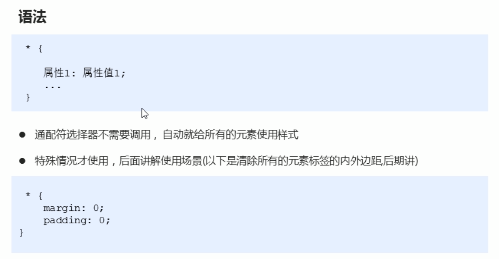
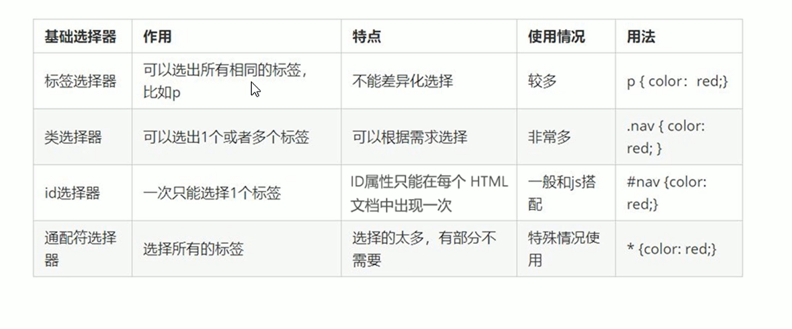

### CSS简介
* CSS是层叠样式表的(Cascading Style Sheets)一个简称
* CSS主要用来美化网页的
* CSS主要用于设计HTML中的**文本内容**(字体、大小、文本方式等)，**图片外形**(宽高、边框样式、边距等)以及版面的布局以及显示样式等

### CSS语法规范
* CSS规则由两部分组成：选择器和一条或者多条声明。
* CSS标签主要写在head（在style里面写）里面，HTML标签主要写在body中

---
### CSS选择器
选择器（选择符）就是根据不同需求把不同的标签选择出来的。
==CSS选择器分为基础选择器和复合选择器==
基础选择器：由一个选择器构成
基础选择器分类：标签选择器、类选择器、id选择器和通配符选择器
##### 标签选择器
标签选择器（元素选择器）是指用HTML的标签名作为选择器，按标签名称分类，为页面某一类标签指定统一的CSS格式
* 优点：能快速为页面相同的标签设置统一的样式
* 缺点：不能设置差异样式，只能选择全部相同的样式
##### 类选择器
如果想要差异化选择不同的标签，单独选一个或者几个标签，可以用**类标签**

* 类的名字在标签里面起

###### 多类名
我们可以给一个标签指定多个类名，从而达到更多的选择目的

* 多类名开发中使用场景
1. 可以把一些标签元素相同的样式（共同部分）放在同一个类里面
2. 这些标签可以调用公共类，然后再调用自己独有的类
3. 节省CSS代码，统一修改也十分方便
---
##### id选择器
id选择器可以为标有特地id的HTML元素指定特定的样式
HTML元素以id属性设置id选择器，CSS中id选择器以"#"来定义

==id是唯一的==
##### 通配符选择器
在CSS中，通配符选择器用"*"来定义，它表示选择页面所有标签（元素）

##### 基础选择器总结

