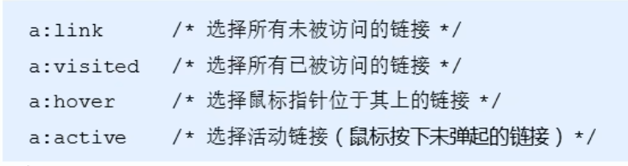
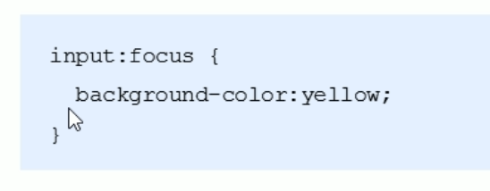

### 复合选择器
* 复合选择器通常由两个或多个简单选择器，通过不同方式组合而成  
* 常用的复合选择器有：后代选择器，子选择器，并集选择器，伪类选择器等  

##### 后代选择器
后代选择器又成为包含选择器，可以选择父元素里面的子元素  

==语法==
    元素1 元素2 { 样式声明 }  
**元素1是父元素，元素2是子元素**  
**元素2可以是子元素，也可以是孙元素，只要是元素1的后代就行**  
**元素1和元素2可以是任意基础选择器**  

##### 子选择器
子选择器只可以选择作为某元素的最近一级子元素。简单理解就是选择亲儿子元素。  

==语法==
    元素1>元素2 { 样式声明 }  

##### 并集选择器
并集选择器可以同时选择多个标签，同时为他们定义相同样式  
==语法==
    元素1,元素2 { 样式声明 }  
**任何选择器都可以作为并集选择器的一部分**  

##### 伪类选择器
伪类选择器用于像某些选择器添加特殊效果，比如给链接添加特殊效果，或选择第一个元素，选择第n个元素。常用:表示  

***伪类选择器有许多种类：链接伪类，结构伪类等***  
###### 链接伪类

==为了确保链接伪类的生效，请按照顺序写link,visited,hover,active==  

###### :focus伪类选择器
:focus伪类选择器用于选取获得的表单元素。  
焦点就是光标，一般情况下，<input>类表单元素才能获取。  
  

### CSS的元素显示模式
* 元素显示模式：元素(标签)以什么方式显示，比如
独占一行，却可以多个占一行  
HTML的元素可以分为两大类：块元素和行内元素  

 #### 块元素
 常见的块元素有：\<h1>到\<h6>,\
,\
,\<ul>,\<ol>,\<li>等  
 可以设置宽和高  
 ==文字类元素中不可以放块级元素，例如\
,\<h1>~\<h6>==  

 #### 行内元素
 常见行内元素：\<a>,\<em>,\<strong>,\<i>,\等  
 不可以设置宽和高  
 ==行内元素只能容纳文本和其他行内元素==  
==特殊情况链接a里面可以放块级元素==  
#### 显示模式的转换  
特殊情况下，我们需要一种显示模式具有另一种显示模式的特性  
转化成块模式**display:block**  
转化成行内模式**display:inline**  
转化成行内块模式**display:inline-block**  

### CSS的背景
##### CSS的背景颜色
background-color定义了元素的背景颜色  
    background-color:颜色值  
一般情况下元素背景颜色默认值是transparent(透明)  

##### 背景图片
background-image属性描述了元素的背景图片  

##### 背景平铺
如果需要在HTML页面上对背景图像进行平铺，可以使用background-repeat属性  

background-repeat: repeat | no-repeat | repeat-x | repeat-y  

可以通过background-position属性改变图片在背景中的位置  

background-position: x y;  

##### 背景图像固定(背景附着)
background-attachment属性设置背景图像是否固定或者页面其余部分滚动  
    background-attachment: scroll | fixed  

##### 背景颜色半透明
background rgba(0,0,0,0.3)  
最后一个参数是alpha透明度，取值在0~1之间  

