### CSS字体属性  
CSS Fonts（字体）属性用于定义字体系列，粗细和文字样式。  
##### 字体系列  
CSS使用font-family属性定义文本的字体系列。  
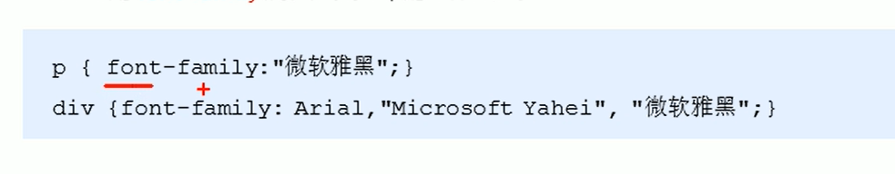
##### 字体大小  
CSS采用font-size属性定义字体大小  
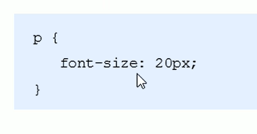
* 可以给body指定整个页面的字体大小  
##### 字体粗细  
CSS采用font-weight属性设置字体粗细  
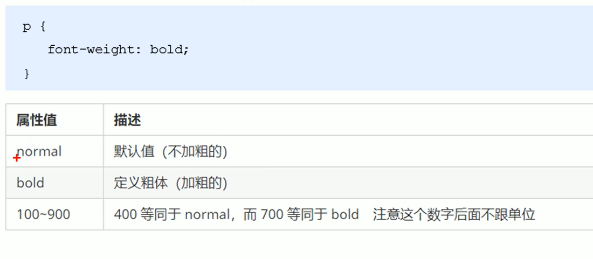
##### 字体样式  
CSS采用font-style属性设置文本的风格  
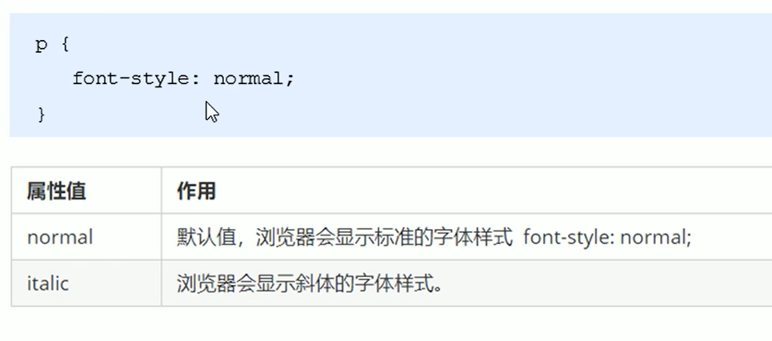
##### 字体复合属性  
字体属性可以把上述字体样式综合起来写，这样可以节约代码  
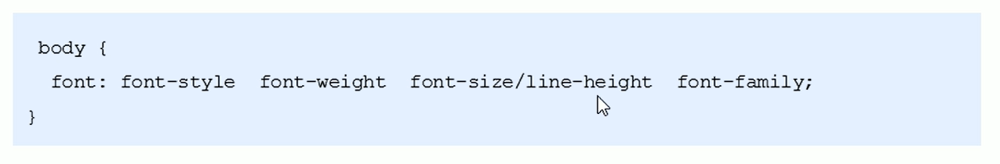

---

### 文本属性  
CSS Text（文本）属性可定义文本的外观，比如文本的颜色、对齐文本、装饰文本、文本缩进、行间距等。  
##### 文本颜色  
color用于定义文本的颜色  
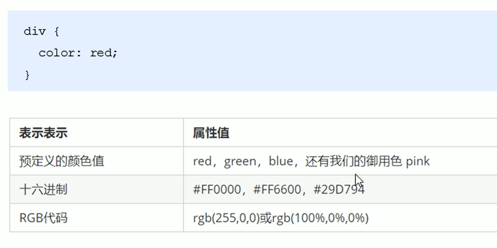
##### 文本对齐  
text-align属性用于设置元素内文本内容的水平对齐方式  
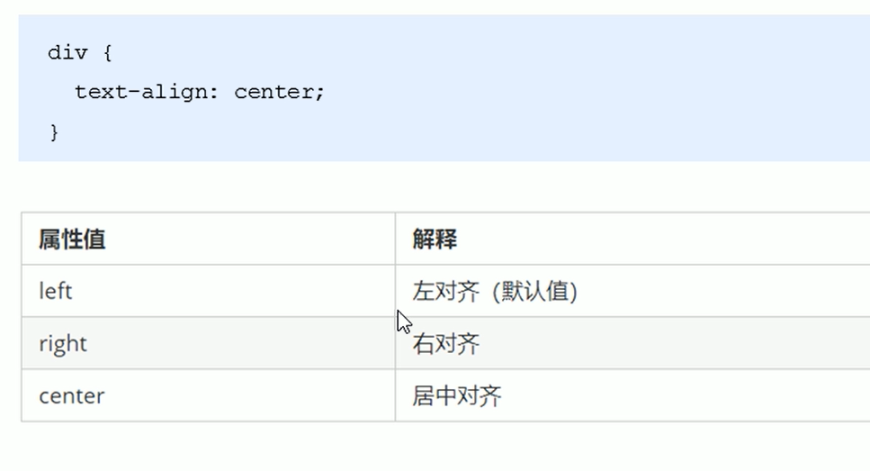
##### 文本装饰  
text-decoration属性规定添加到文本的装饰。可以给文本添加下划线、删除线或者上划线等。  
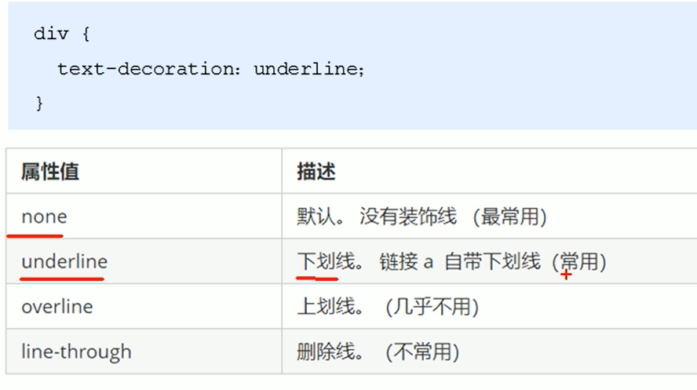
##### 文本缩进  
text-indent属性用来指定文本第一行的缩进，通常是将段落首行缩进。  
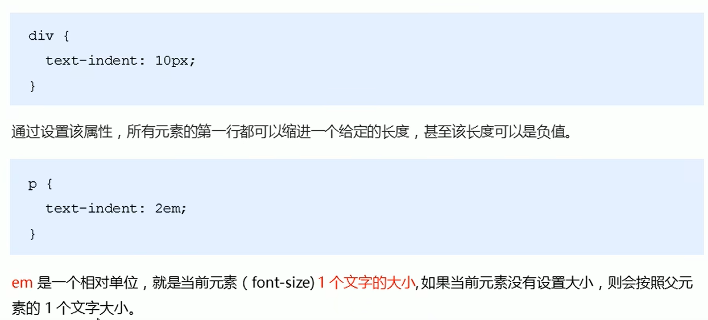
##### 行间距  
line-height属性用于设置行间的距离。  
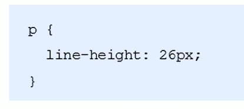

---

### CSS引入方式
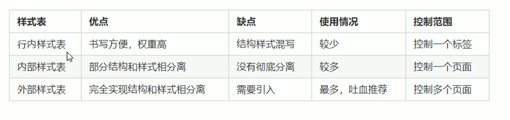
* ==行内样式表==是直接在元素标签里面style中设置属性，使用简单的标签  
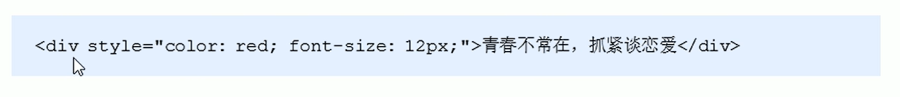
* ==内部样式表==跟之前讲的例题一样，在\<head>中的\<style>中写  
* ==外部样式表==适用于样式比较多的情况下，核心是样式单独写在CSS文件中，然后将CSS导入HTML中使用  
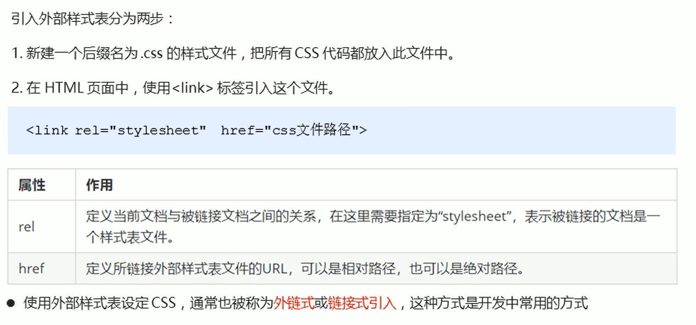

