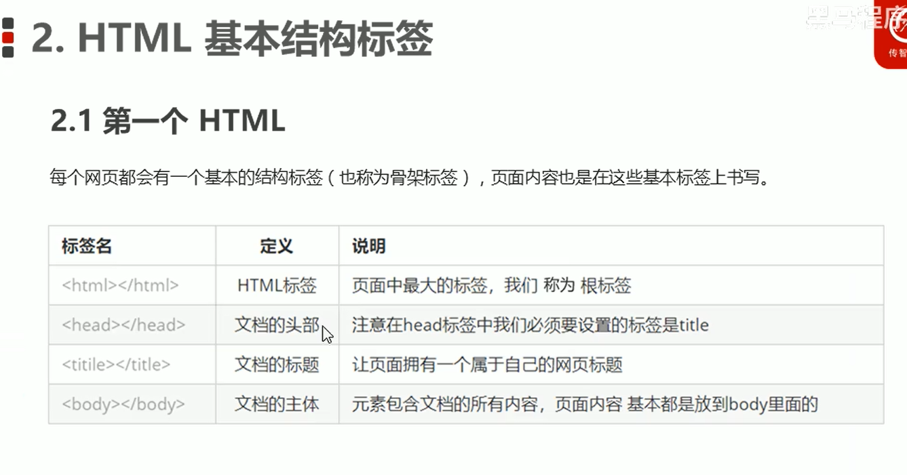
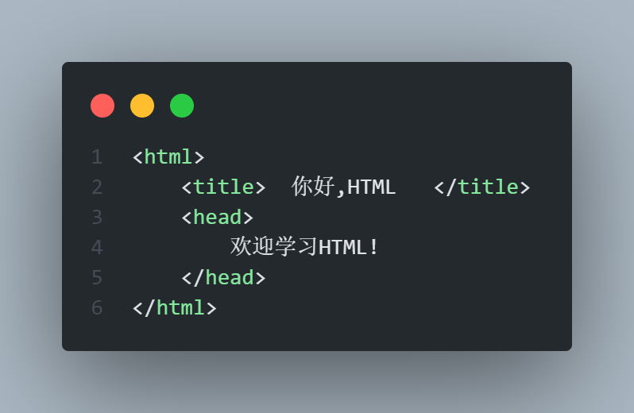
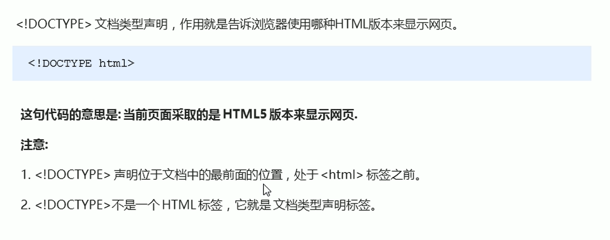
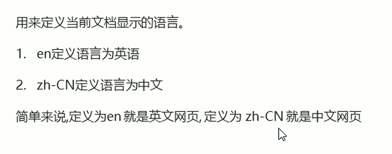
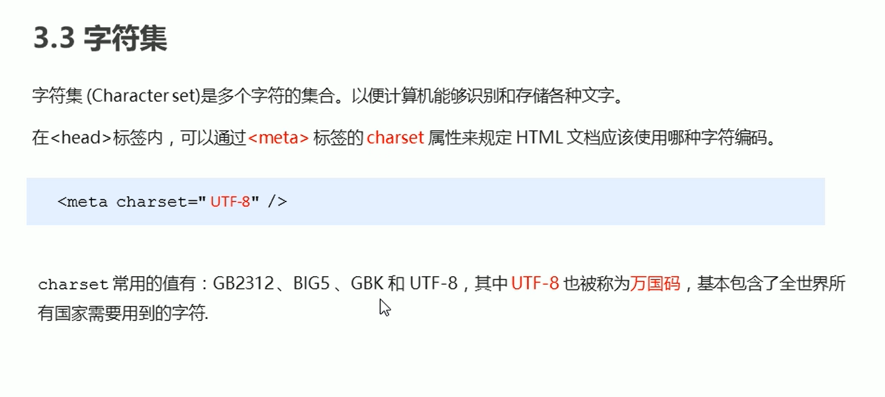
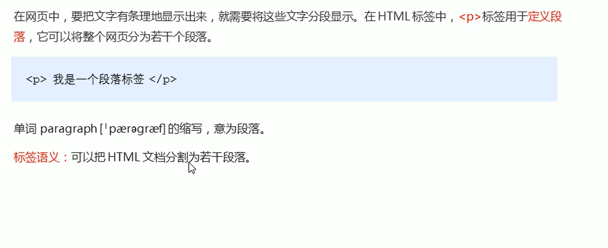

### html标签
##### 一、html基本结构标签
  
代码  

###### 基本结构标签总结

### 网页开发工具
##### 一、文档类型声明标签

##### 二、lang语言种类

##### 三、字符集

### HTML常用标签
##### 一、标题标签
h1-h6

##### 二、段落和换行标签
段落标签

换行标签

换行标签特点：  
1、是一个单标签  
2、跟段落标签不一样，段落标签是有空隙的，换行没有

