### html标签
##### 一、html基本结构标签
  
代码  
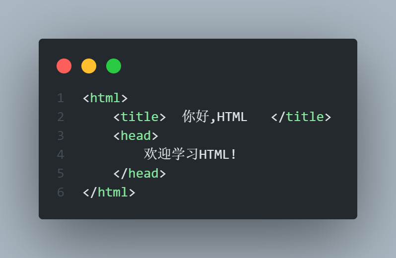

###### 基本结构标签总结

### 网页开发工具
##### 一、文档类型声明标签

##### 二、lang语言种类
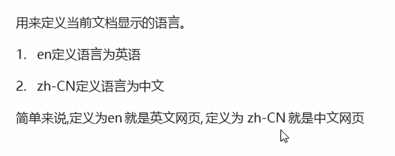
##### 三、字符集

### HTML常用标签
##### 一、标题标签
h1-h6

##### 二、段落和换行标签
段落标签
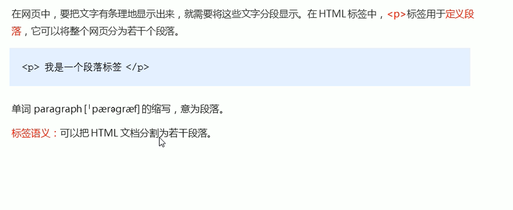
换行标签
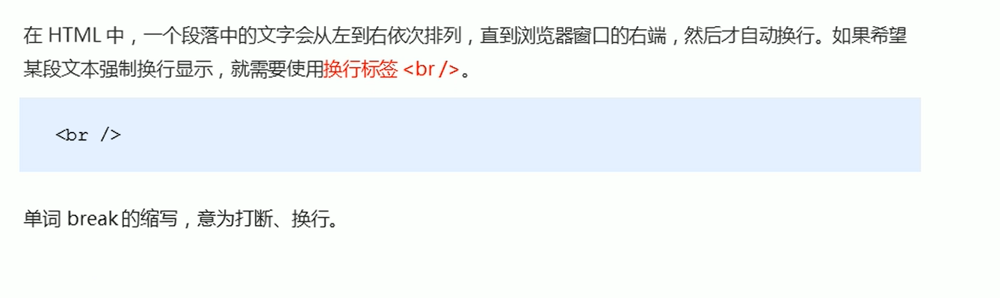
换行标签特点：  
1、是一个单标签  
2、跟段落标签不一样，段落标签是有空隙的，换行没有

##### 文本格式化标签

##### div标签和snap标签(盒子标签)

##### 图像标签和路径(重点)
必须将图片放到文件里面  

其他属性：  

##### 超链接标签
用< a >来表示  
###### 链接的语法格式

链接的分类：  
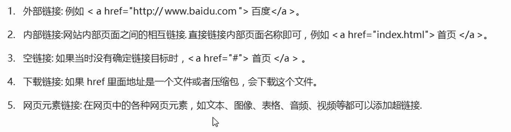
6、锚点链接  
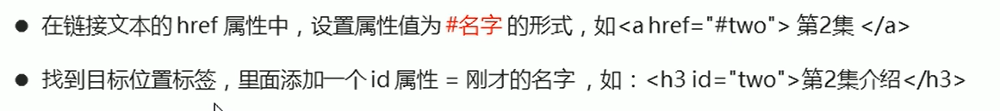
##### html注释标签
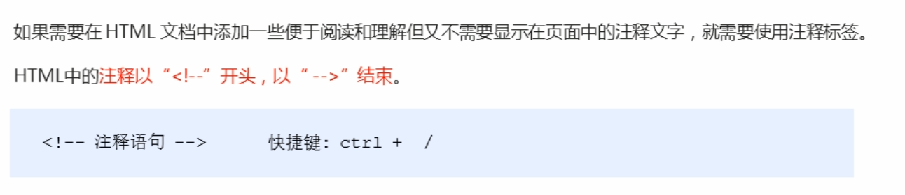
##### html特殊字符
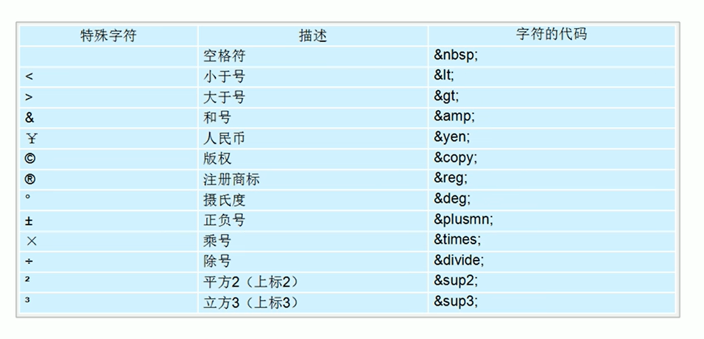

### 表格标签
#### 一、表格标签的作用
表格主要用于显示和展示数据,使得数据可读性高
#### 二、表格基本语法
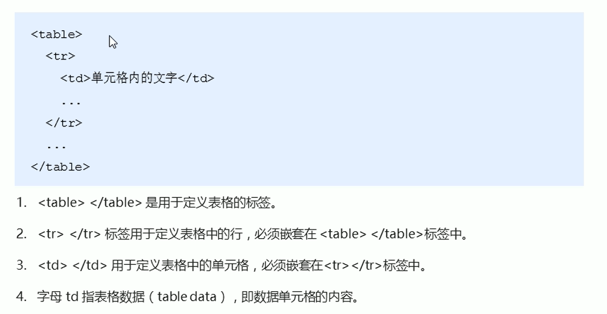
#### 三、表头单元格标签
一般来说。表头单元格位于表格的第一行或者第一列，表头单元格里面文本内容加粗居中显示  
\<th>标签来表示HTML中的标头

#### 四、表格属性
*表格标签这部分属性我们实际开发不用，后期可以通过**CSS**来设置*
目的：  
1. 记住这些英语单词，方便后面CSS使用
2. 直观感受表格的外观形态

***！！！！标签属性要写到table里面去！！！！***
==width和height代表宽和高==
---
### 表格结构标签
使用场景：因为表格可能很长，为了更好的表示表格的语义，可以将表格分割成表格头部和表格主体两大部分。  
==在表格结构标签中，通常用\<thead>和<tbody>分别表示头部区域和主体区域==

### 合并单元格
##### 合并单元格方式
* 跨行合并：rowspan="合并单元格的个数"  
* 跨列合并: colspan="合并单元格的个数"  

目标单元格:(写合并代码)  
* 跨行写在最上侧单元格
* 跨列写在最左侧单元格

### 列表标签
* 表格是用来展示数据的，列表是用来布局的  
* 列表的最大特点是整齐、整洁、有序，它作为布局会更加方便和自由  
* 列表分类：无序列表、有序列表、自定义列表  
####  无序列表（重要）
\<ul>标签表示HTML中项目的无序列表，一般以项目符号呈现列表项，而列表项用\<li>标签表示。  

***\<ul>标签里面只能放\<li>标签***  
***\<li>与\<li>之间能放任何标签***  
#### 有序列表
在HTML中用\<ol>标签来表示有序列表，列表项用\<li>表示  
#### 自定义列表（重点）
* 使用场景：  
自定义列表常用于对术语或名词进行解释和描述，定义列表的列表项前没有任何项目符号。  
* 自定义列表示例  

* 在HTML中\<dl>标签通常用来表示自定义列表，该标签会有\<dt>（定义项目\名字）和\<dd>（描述每一个项目\名字）一起使用  
* 具体语法  

---

### 表单标签
* 表单的目的是为了收集用户信息
* 表单的组成  
==在HTML中，一个完整的表单通常由**表单域**，**表单控件（也可以成为表单元素）**和**提示信息**三部分组成==  
#### 表单域  
表单域是一个包含表单元素的区域  
在HTML中，用\<form>标签定义表单域，以实现用户信息的收集和传递。  
==\<form>会把他范围内的表单元素提交给服务器==  
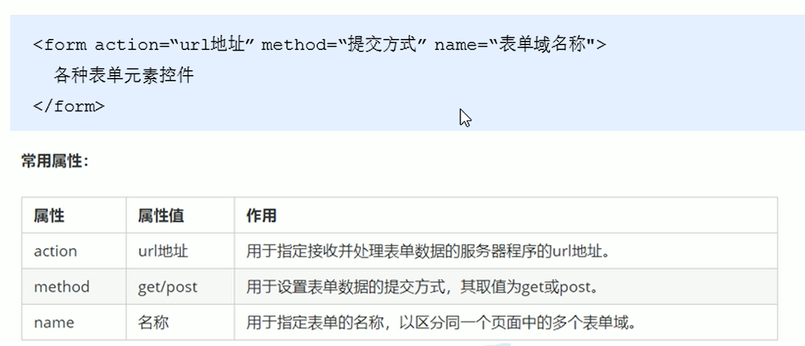
#### 表单元素
在表单域中可以定义各种表单元素，这些表单元素就是允许用户在表单中输入或者选择的内容控件  
###### input输入表单元素
\<input>标签用于收集用户消息  
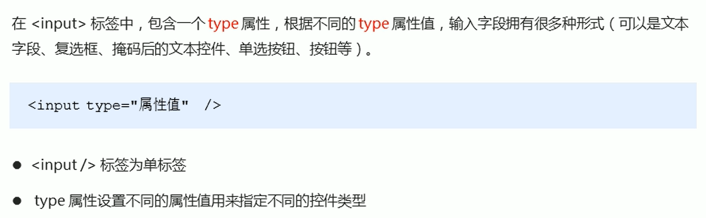

除type属性外，\<input>标签还有其他很多属性  

###### \<lable>标签
\<lable>标签为input元素定义标注  
\<lable>标签用于绑定一个表单元素，当点击\<lable>标签内的文本时，浏览器会自动将焦点（光标）转移到或者选择到对应的表单元素上，以增加用户的体验。  

==核心，lable标签里的for属性与input里面的id属性一样才行==  
#### select下拉表单元素

#### textarea文本域元素

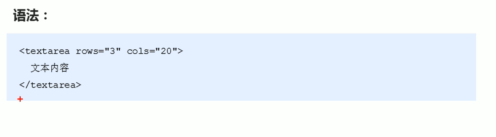

