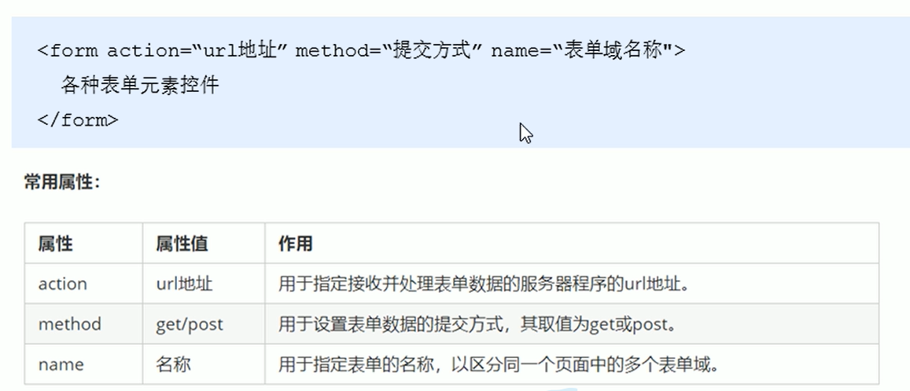
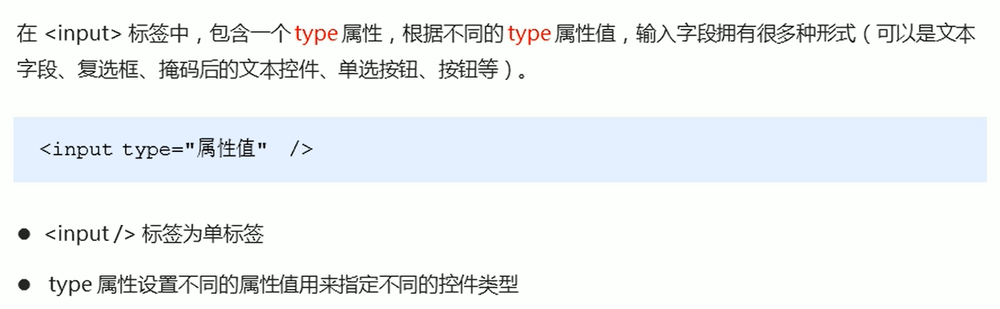
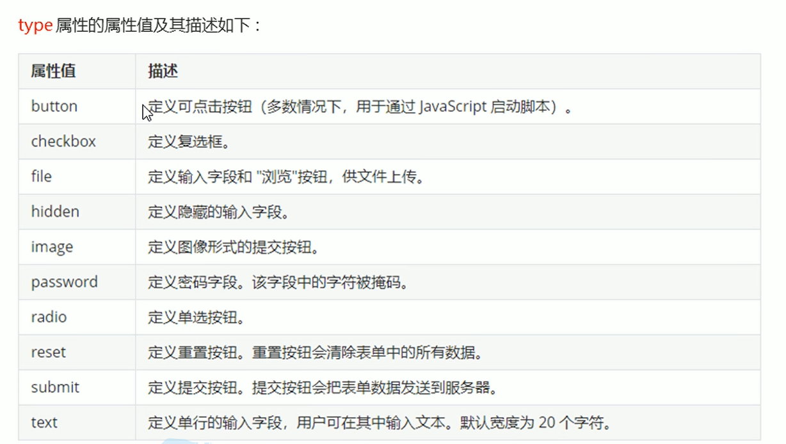
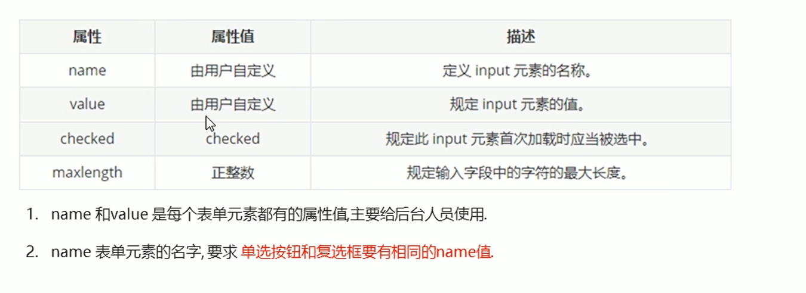
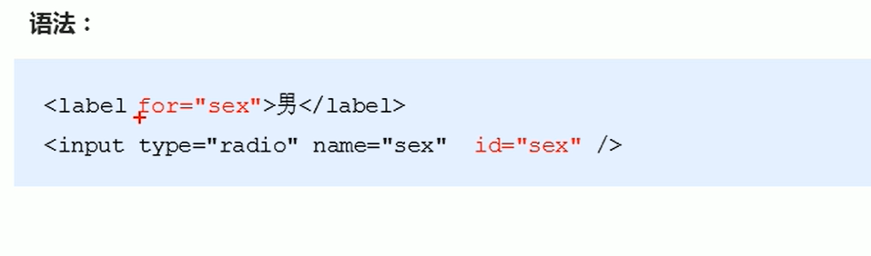
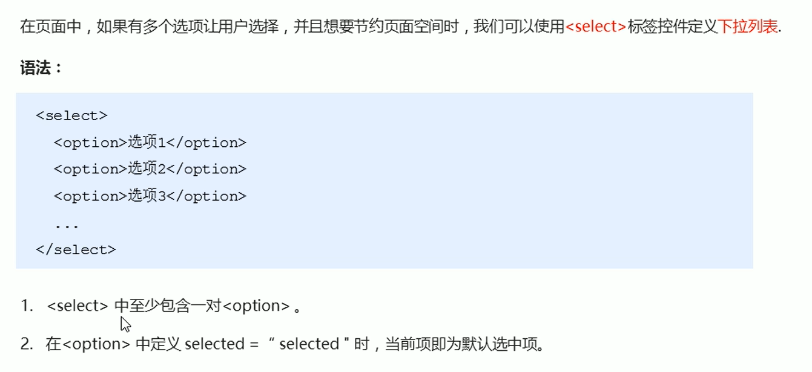
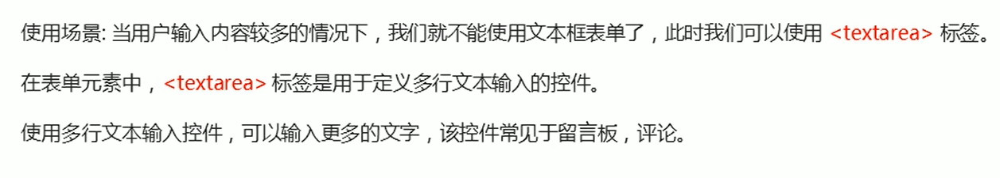
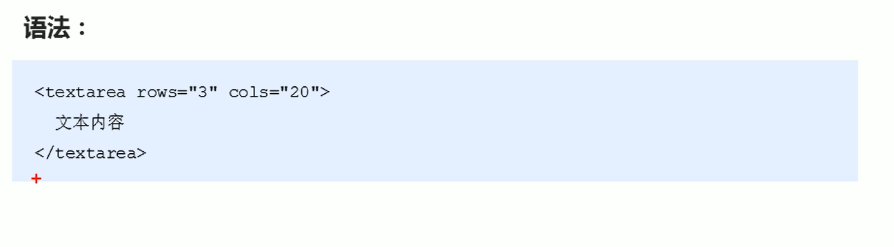

### 列表标签
* 表格是用来展示数据的，列表是用来布局的  
* 列表的最大特点是整齐、整洁、有序，它作为布局会更加方便和自由  
* 列表分类：无序列表、有序列表、自定义列表  
####  无序列表（重要）
\<ul>标签表示HTML中项目的无序列表，一般以项目符号呈现列表项，而列表项用\<li>标签表示。  

***\<ul>标签里面只能放\<li>标签***  
***\<li>与\<li>之间能放任何标签***  
#### 有序列表
在HTML中用\<ol>标签来表示有序列表，列表项用\<li>表示  
#### 自定义列表（重点）
* 使用场景：  
自定义列表常用于对术语或名词进行解释和描述，定义列表的列表项前没有任何项目符号。  
* 自定义列表示例  

* 在HTML中\<dl>标签通常用来表示自定义列表，该标签会有\<dt>（定义项目\名字）和\<dd>（描述每一个项目\名字）一起使用  
* 具体语法  

---

### 表单标签
* 表单的目的是为了收集用户信息
* 表单的组成  
==在HTML中，一个完整的表单通常由**表单域**，**表单控件（也可以成为表单元素）**和**提示信息**三部分组成==  
#### 表单域  
表单域是一个包含表单元素的区域  
在HTML中，用\<form>标签定义表单域，以实现用户信息的收集和传递。  
==\<form>会把他范围内的表单元素提交给服务器==  

#### 表单元素
在表单域中可以定义各种表单元素，这些表单元素就是允许用户在表单中输入或者选择的内容控件  
###### input输入表单元素
\<input>标签用于收集用户消息  

除type属性外，\<input>标签还有其他很多属性  

###### \<lable>标签
\<lable>标签为input元素定义标注  
\<lable>标签用于绑定一个表单元素，当点击\<lable>标签内的文本时，浏览器会自动将焦点（光标）转移到或者选择到对应的表单元素上，以增加用户的体验。  

==核心，lable标签里的for属性与input里面的id属性一样才行==  
#### select下拉表单元素

#### textarea文本域元素

