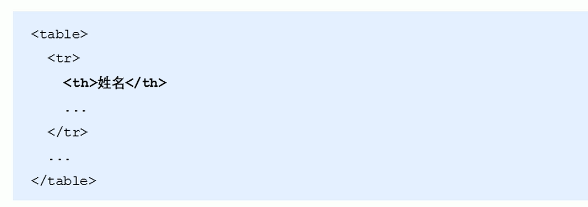
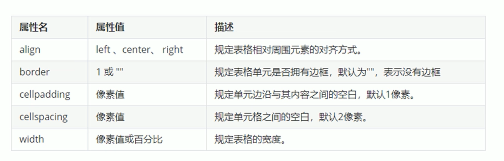
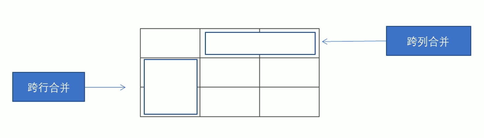
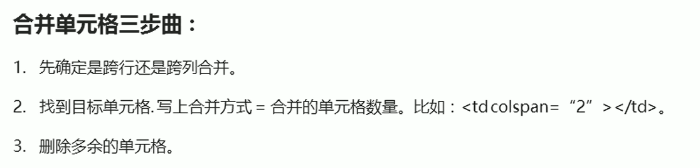

### 表格标签
#### 一、表格标签的作用
表格主要用于显示和展示数据,使得数据可读性高
#### 二、表格基本语法

#### 三、表头单元格标签
一般来说。表头单元格位于表格的第一行或者第一列，表头单元格里面文本内容加粗居中显示  
\<th>标签来表示HTML中的标头

#### 四、表格属性
*表格标签这部分属性我们实际开发不用，后期可以通过**CSS**来设置*
目的：  
1. 记住这些英语单词，方便后面CSS使用
2. 直观感受表格的外观形态

***！！！！标签属性要写到table里面去！！！！***
==width和height代表宽和高==
---
### 表格结构标签
使用场景：因为表格可能很长，为了更好的表示表格的语义，可以将表格分割成表格头部和表格主体两大部分。  
==在表格结构标签中，通常用\<thead>和<tbody>分别表示头部区域和主体区域==

### 合并单元格
##### 合并单元格方式
* 跨行合并：rowspan="合并单元格的个数"  
* 跨列合并: colspan="合并单元格的个数"  

目标单元格:(写合并代码)  
* 跨行写在最上侧单元格
* 跨列写在最左侧单元格

